<picture>
  <source media="(prefers-color-scheme: dark)" srcset="assets/header.svg">
  <source media="(prefers-color-scheme: light)" srcset="assets/header-light.svg">
  
</picture>

**Software Engineer II · Full Stack Product Engineer · India**

[Portfolio](https://sachinkaythamwar.com) · [Resume](https://sachinkaythamwar.com/resume/Sachin_Kaythamwar_Resume.pdf) · [Projects](https://sachinkaythamwar.com/projects) · [Blog](https://sachinkaythamwar.com/blog) · [LinkedIn](https://linkedin.com/in/sachin-kaythamwar-969178234) · [Email](mailto:kaythamwarsachin@gmail.com)

**Open to SDE-2, Product Engineer, and Senior Full Stack roles.**

<picture>
  <source media="(prefers-color-scheme: dark)" srcset="assets/stack.svg">
  <source media="(prefers-color-scheme: light)" srcset="assets/stack-light.svg">
  
</picture>

## About me

I'm Sachin Kaythamwar, a full stack engineer with 3+ years of experience and 21 shipped or in-progress projects across ERP, CRM, SaaS, ecommerce, platform engineering, and interactive 3D web.

I build enterprise products end to end, from the data model and APIs to the screens people use every day. Most of my work is workflow-heavy business software: orders, invoices, approvals, pricing rules, and the dashboards that sit on top of them. I care about codebases that stay maintainable as they grow, and I build reusable modules so the next product starts further ahead than the last one.

<picture>
  <source media="(prefers-color-scheme: dark)" srcset="assets/stats.svg">
  <source media="(prefers-color-scheme: light)" srcset="assets/stats-light.svg">
  
</picture>

## Experience

**Software Engineer II**, AI Tech Ture Labs LLP · 2023 to present

- Built ERP modules for purchase orders, sales orders, job cards, purchase and sales invoices, and inventory
- Built a settings-driven pricing engine covering gold, diamond, labour, and product pricing models
- Designed REST and GraphQL APIs with JWT and OAuth authentication and authorization
- Added real-time features over WebSockets and Redis caching for performance
- Built CRM portals, KPI dashboards, and reporting systems used for day-to-day business decisions
- Built ecommerce platforms with catalog management, inventory sync, order processing, and checkout
- Built browser-based floor-planning tools and interactive Three.js experiences
- Contributed to the company's Modular Monolith architecture and its library of reusable business modules

## How I structure products

<picture>
  <source media="(prefers-color-scheme: dark)" srcset="assets/layers.svg">
  <source media="(prefers-color-scheme: light)" srcset="assets/layers-light.svg">
  
</picture>

- **Modular Monolith:** feature modules with strict boundaries give microservice-like isolation without the operational overhead. Split services only when the domain demands it.
- **Clean Architecture:** business logic stays framework-agnostic and testable. Dependencies point inward, with the domain at the center and infrastructure at the edges.
- **DDD-Lite:** each feature module models its own entities, invariants, and use cases, with no domain coupling across features.
- **Scale when metrics say so:** stateless APIs, caching layers, and async workflows make horizontal scaling possible; optimisation follows measurement.

## Selected work

Full case studies, with the problem, architecture, and trade-offs, are on my portfolio: **[sachinkaythamwar.com/projects](https://sachinkaythamwar.com/projects)**

### At work

<picture>
  <source media="(prefers-color-scheme: dark)" srcset="assets/workflow.svg">
  <source media="(prefers-color-scheme: light)" srcset="assets/workflow-light.svg">
  
</picture>

| Project | What I built | Impact |
| --- | --- | --- |
| **[B2B Jewelry Operations ERP](https://sachinkaythamwar.com/projects/b2b-jewelry-operations-erp)** | Cart → sales order → purchase order → job card workflow, settings-driven gold/diamond/labour pricing, bulk Excel catalog import with validation, RBAC, and audit logging | Replaced manual Excel catalog updates and fragmented order tracking with one system from catalog to invoice |
| **[Jewelry Fulfillment & Procurement ERP](https://sachinkaythamwar.com/projects/jewelry-fulfillment-erp)** | Procurement operations dashboard and Finance Manager purchase invoice UI on a PostgreSQL-backed platform | At-a-glance procurement health and invoice payment status across 10,000+ purchase invoice records |
| **[Study Abroad Admissions Platform](https://sachinkaythamwar.com/projects/study-abroad-admissions-platform)** | Student, counselor, admin, and superadmin dashboards, application and document workflows, AI search, real-time messaging, and commission policies | Brought lead capture through application approval into a single platform |
| **[Enterprise Feature Framework](https://sachinkaythamwar.com/projects/enterprise-feature-framework)** | Shared RBAC, approval workflow, audit logging, notification, and dynamic CRUD modules used across multiple business applications | Shorter time-to-market for new ERP and CRM modules |

### Personal

| Project | What I built | Impact |
| --- | --- | --- |
| **[App Generator](https://sachinkaythamwar.com/projects/app-generator)** | Metadata-driven visual page builder: design multi-page React apps in the browser, store the page tree in MongoDB through a Deno API, and export a deployable React + Vite project | Cuts app scaffolding from days to hours |
| **[HR Workspace Suite](https://sachinkaythamwar.com/projects/hr-workspace-suite)** | Multi-tenant HRMS with leave policies and accrual, attendance with geolocation, time tracking, onboarding, org branding, MFA, and multi-language support | A complete multi-tenant SaaS reference with enterprise security |
| **[E-Commerce Dynamic Platform](https://sachinkaythamwar.com/projects/ecommerce-dynamic-platform)** | Modular-monolith commerce backend (cart, orders, payments, promotions, returns, shipping) with an event-driven outbox and a Next.js storefront | A production-style order lifecycle with observability built in |

<b>More projects</b>

 

- **Education Consultancy CRM:** leads, sales, invoicing, real-time chat, assessments, and counselor leave, built on Django
- **Excel Dashboard Builder:** drag-and-drop dashboards with KPI, chart, funnel, and table widgets driven by Excel data
- **Excel Data Automation Platform:** store, COM, and omni forecast views with calculation breakdowns for retail planners
- **Immersive 3D Commerce Platform:** Three.js product visualisation for configurable jewelry (in progress)
- **Enterprise Feature Kit:** reusable Clean Architecture backend with MongoDB/PostgreSQL support, RBAC, approvals, and OpenAPI docs
- **AllocateIQ:** team resource planning with allocations, time entries, reviews, and real-time updates
- **Froxcel and Excel Formula Analyzer:** spreadsheet upload, formula analysis, dependency recalculation, and chart building

All 21 are on [my portfolio](https://sachinkaythamwar.com/projects).

## Writing

- **[Modular Monolith vs Microservices](https://sachinkaythamwar.com/blog/modular-monolith-vs-microservices):** when a modular monolith is the better choice, and how to structure modules for future extraction
- **[Building Reusable Business Modules](https://sachinkaythamwar.com/blog/building-reusable-business-modules):** designing enterprise modules that compose across ERP, CRM, and SaaS products
- **[Clean Architecture in MERN](https://sachinkaythamwar.com/blog/clean-architecture-in-mern):** applying Clean Architecture and DDD-Lite to MERN applications
- **[GraphQL at Scale](https://sachinkaythamwar.com/blog/graphql-at-scale):** schema design, DataLoader patterns, and authorization for production GraphQL APIs
- **[Scaling React Applications](https://sachinkaythamwar.com/blog/scaling-react-applications):** code splitting, state management, and rendering strategies for large React and Next.js frontends

I also keep an **[Engineering Library](https://sachinkaythamwar.com/engineering-library)** of the patterns I reuse across products: RBAC, approval workflows, audit logging, multi-tenant architecture, dynamic forms, file uploads, notifications, and WebSocket infrastructure.

## Tech stack

| Area | Tools |
| --- | --- |
| **Frontend** | React, Next.js, TypeScript, JavaScript, Redux, Tailwind CSS, Material UI, Three.js |
| **Backend and APIs** | Node.js, Express.js, Deno, Django, FastAPI, REST, GraphQL, WebSockets |
| **Data** | MongoDB, PostgreSQL, MySQL, Redis |
| **Cloud and tooling** | Docker, AWS, Git, GitHub, CI/CD, Vitest |
| **Architecture** | Modular Monolith, Clean Architecture, Feature-Based Architecture, DDD-Lite, MVC |

## Education and certifications

**B.E. in Computer Engineering**, St. John College of Engineering and Management, Maharashtra, India · 2022

- NodeJS: The Complete Guide (MVC, REST APIs, GraphQL, Deno)
- Angular & NodeJS: The MEAN Stack Guide
- Angular: The Complete Guide
- React JS: Complete Guide for Frontend Web Development
- Python Data Structures

## Get in touch

For roles and collaborations, use the [contact page](https://sachinkaythamwar.com/contact) or email [kaythamwarsachin@gmail.com](mailto:kaythamwarsachin@gmail.com).

<picture>
  <source media="(prefers-color-scheme: dark)" srcset="assets/footer.svg">
  <source media="(prefers-color-scheme: light)" srcset="assets/footer-light.svg">
  
</picture>
